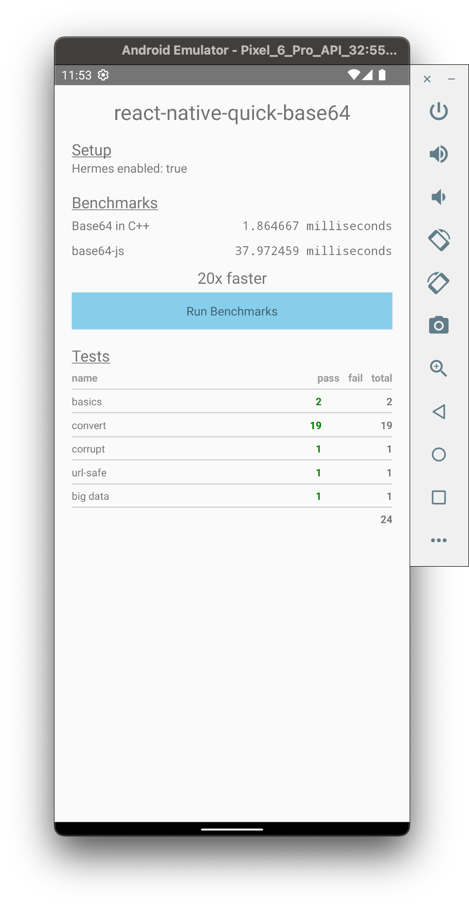

# react-native-quick-base64

A native implementation of Base64 in C++ for React Native.

~16x faster than [base64-js](https://github.com/beatgammit/base64-js) on an iPhone 15 Pro Max simulator.
Try the benchmarks under [example](./example).

| iPhone                                            | Android                                             |
| ------------------------------------------------- | --------------------------------------------------- |
|  |  |

## Installation

```sh
npm install react-native-quick-base64
```

## Usage

```js
import { btoa, atob } from 'react-native-quick-base64'

const base64 = btoa('foo')
const decoded = atob(base64)
```

## Methods

Compatible with [base64-js](https://github.com/beatgammit/base64-js).

#### `byteLength(b64: string): number`

Takes a base64 string and returns length of byte array.

#### `toByteArray(b64: string, removeLinebreaks: boolean = false): Uint8Array`

Takes a base64 string and returns a byte array.  Optional `removeLinebreaks` removes all `\n` characters.

#### `fromByteArray(uint8: Uint8Array, urlSafe: boolean = false): string`

Takes a byte array and returns a base64 string.  Optional `urlSafe` flag `true` allows for use in URLs.

#### `btoa(data: string): string`

Encodes a string in base64.

#### `atob(b64: string): string`

Decodes a base64 encoded string.

#### `shim()`

Adds `btoa` and `atob` functions to `global`.

#### `trimBase64Padding = (str: string): string`

Trims the `=` padding character(s) off of the end of a base64 encoded string.  Also, for base64url encoded strings, it will trim off the trailing `.` character(s).

## Contributing

See the [contributing guide](CONTRIBUTING.md) to learn how to contribute to the repository and the development workflow.

## License

MIT by Takuya Matsuyama
